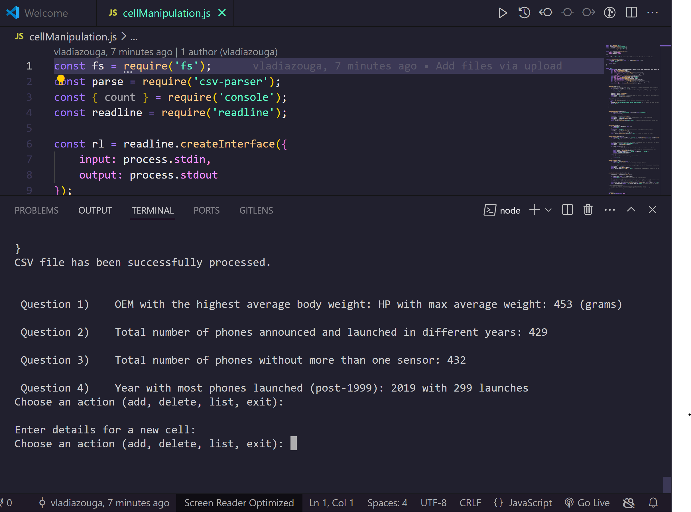

# Cell Manipulation Script

## Programming Language and Version
This codebase is developed using **JavaScript** on the **Node.js** runtime environment. Node.js is chosen for its efficient handling of asynchronous operations and is powered by the V8 JavaScript engine, making it ideal for server-side applications.

## Choice of Programming Language
JavaScript was selected for this project due to its widespread use and support for asynchronous programming, which is ideal for handling I/O operations such as file reading and user interactions efficiently. Its event-driven nature allows for non-blocking operations, making it particularly suitable for tasks that involve heavy I/O operations, such as processing CSV files in this script.

## Features of JavaScript in the Code
- **Object-Oriented Programming:** The script utilizes JavaScript’s support for OOP through ES6 classes to create a `Cell` class, encapsulating cell phone data and behaviors.
- **File Ingestion:** File operations are managed using the `fs` module, demonstrating JavaScript's capability to handle file streams effectively.
- **Conditional Statements and Assignment Statements:** The script includes various conditional logic and variable assignments using `let` and `const`, ensuring tight scope control.
- **Loops:** The use of array methods like `forEach` reflects JavaScript’s functional programming features used for iterating over arrays.
- **Subprograms (Functions/Methods):** Functions are a fundamental part of this script, organized logically to perform specific tasks and enhance code reusability.
- **Unit Testing:** Not implemented in this script, but JavaScript supports unit testing through frameworks such as Jest and Mocha.
- **Exception Handling:** Basic error handling is integrated, using callbacks in file operations to manage exceptions gracefully.

## Libraries Used
1. **fs (File System):** Integral for file operations, chosen for its comprehensive API and native support in Node.js, essential for reading and writing files.
2. **csv-parser:** Selected for its straightforward and efficient parsing of CSV files into JavaScript objects, crucial for the application's data processing needs.
3. **readline:** A core Node.js module, facilitating the reading of input from the console, enabling interactive user experiences within the command line.

These libraries were selected to maximize efficiency and functionality in handling file operations, parsing data, and interacting with users within the Node.js environment.

## Assignment Questions

**Q1: What company (oem) has the highest average weight of the phone body?**
- **A1:** The OEM with the highest average body weight is HP, with an average weight of 453 grams.

**Q2: Was there any phones that were announced in one year and released in another? What are they? Give me the oem and models.**
- **A2:** Yes, there are a total of 429 phones that were announced in one year and launched in another. The OEMs and models are not listed individually due to the large number.

**Q3: How many phones have only one feature sensor?**
- **A3:** There are 432 phones that have only one feature sensor.

**Q4: What year had the most phones launched in any year later than 1999?**
- **A4:** The year 2019 saw the most phones launched, with a total of 299 launches.

### Here is an image of the terminal 

## Unit Testing of My Methods
- These are pictures of my unit testing of my methods (4 of my methods are used to answer the questions)
The last 3 methods are: adding an object, delete an object, list unique values 

